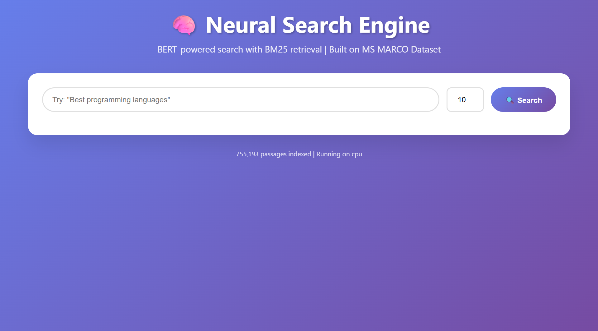
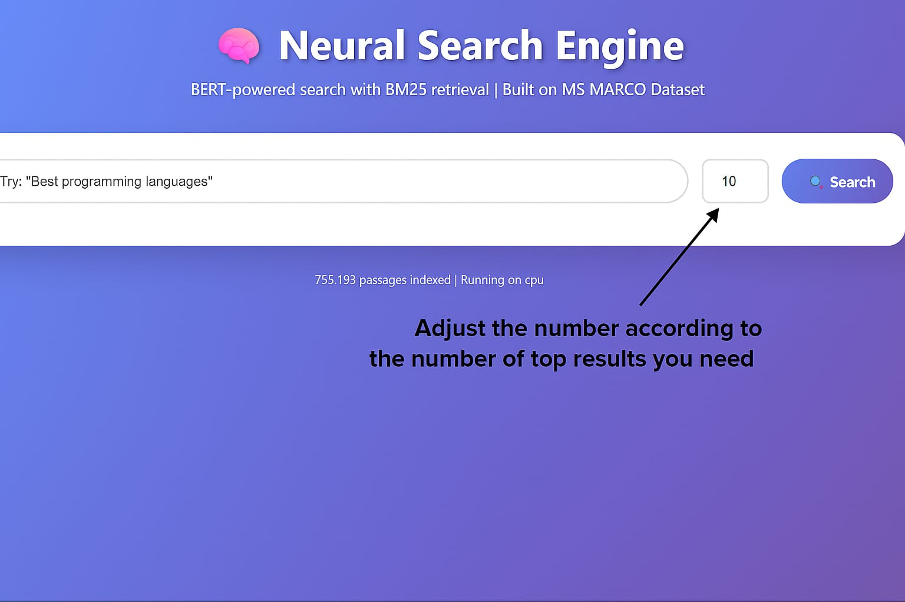
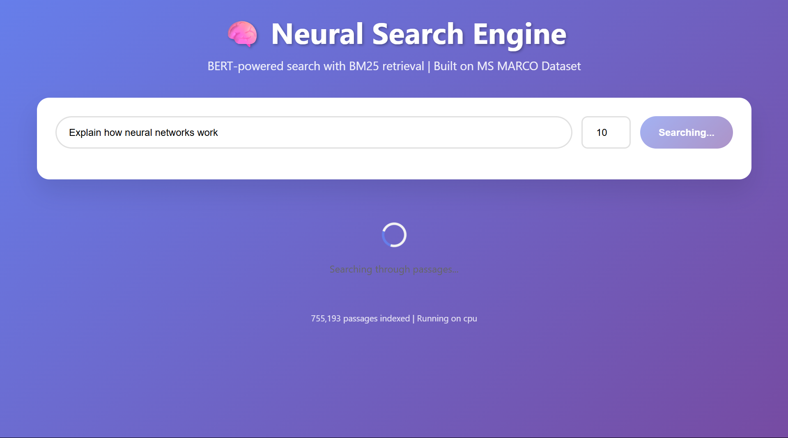
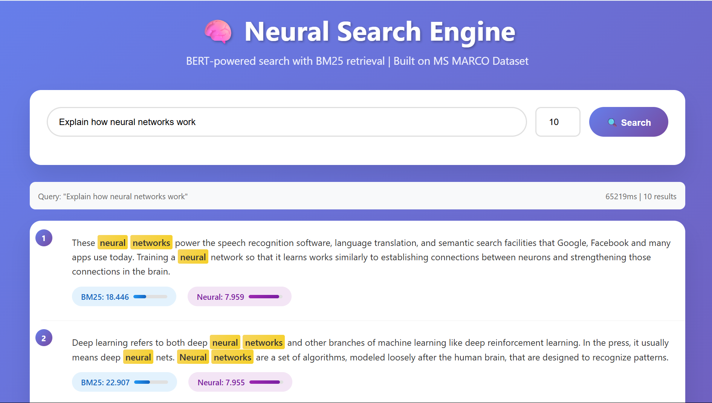

# BERT-Neural-Search-Engine

A dual-stage AI-powered search engine combining fast BM25 retrieval with advanced BERT-based neural reranking for highly relevant, semantic search results. Built on the MS MARCO dataset, this project demonstrates a modern approach to large-scale information retrieval.



## Table of Contents

- [Features](#features)
- [Demo](#demo)
- [System Overview](#system-overview)
- [Dataset & Preprocessing](#dataset--preprocessing)
- [Installation](#installation)
- [Usage](#usage)
- [Project Structure](#project-structure)
- [Contributors](#contributors)
- [Future Work](#future-work)

## Features

- **Hybrid retrieval**: BM25 for fast candidate selection, BERT for neural reranking
- **User-friendly web interface** for querying and result exploration
- **Adjustable top-k results** for flexible search needs
- **Scalable preprocessing and evaluation pipeline**
- **Built on real-world MS MARCO dataset**

## Demo

### Landing Page


- Enter your query in the search bar
- Adjust the number for top results as needed
- Click "Search" to get results

### Searching State


- The system searches through over 755,000 indexed passages
- Real-time feedback on search progress

### Results Display


- Top results are shown with both BM25 and Neural (BERT) scores
- Relevant keywords are highlighted
- Query and result count are displayed for transparency

## System Overview

1. **BM25 Indexing**: Fast lexical retrieval to shortlist relevant passages
2. **Pair Generation**: Builds positive and negative query-passage pairs for neural training
3. **BERT Reranker**: Re-ranks BM25 candidates using a fine-tuned BERT model for semantic matching
4. **Evaluation**: Reports metrics like MRR and precision to measure system performance

## Dataset & Preprocessing

- **Source**: MS MARCO dataset
- **Scale**: ~10,000 queries, 800,000 passages (subset for demonstration)
- **Cleaning**: Removes nulls, non-English content, and irrelevant samples
- **Mapping**: Links queries to passages using provided relevance labels

## Installation

```bash
git clone https://github.com/Mrigank22/Bert-Neural-Search-Engine.git
cd Bert-Neural-Search-Engine
pip install -r requirements.txt
```

**Requirements:**  
Python 3.8+, PyTorch, transformers, rank-bm25, polars, scikit-learn, nltk, pandas, numpy

## Usage

### 1. Run the server 

```bash
uvicorn app:app --host 0.0.0.0 --port 8080 
```
- You can visit the website on localhost:8080 in your browser

## Contributors

- **Sandhya S** (BM25, dataset, analysis)  
- **Mrigank Pendyala** (Web interface, integration)  
- **Sharvani Pallempati** (Preprocessing, hyperparameter tuning)  
- **Sandhineni Mithil** (BERT reranker, training, evaluation)  

## Future Work

- Integrate hard negatives from BM25 for improved neural training
- Scale up with larger datasets and GPU clusters
- Add multilingual and domain adaptation capabilities

---

**For methodology and detailed results, see the project report.**

*Images used in this README are included in the `images/` directory:*
- `Main.png` – Landing page and query input
- `Landing.jpg` – Edited Landing page and query input
- `Searching.jpg` – Searching state
- `Results.jpg` – Example results with scores and highlights
